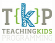

## Welcome to [Teaching Kids Programming (TKP)](http://www.teachingkidsprogramming.org) Lesson Plans for TKPJava

This Penflip project contains the lesson plan library for K-12 teachers to use when teaching TKPJava courseware.  TKPJava is designed for kids ages 10+ and is most often used with kids at the middle or high school level.

There is one Lesson Plan for each TKPJava Course.  Each lesson plan is designed, written and tested by a group of K-12 teachers and programmers. The Java code for teaching is found on the [TKP repository on Github](https://github.com/TeachingKidsProgramming/TeachingKidsProgramming.Java).  This repository includes computer setup instructions (in the README.md file).  

You can use these lesson plans by accessing them via Penflip (online) or by customizing them for your classroom.  To customize, click the 'edit' button on this page and then sign in to Penflip.  You will then be creating your own version of the lessons which will be saved in Penflip .

_Happy Teaching!_

- Talk to a person: lynn@teachingkidsprogramming.org
