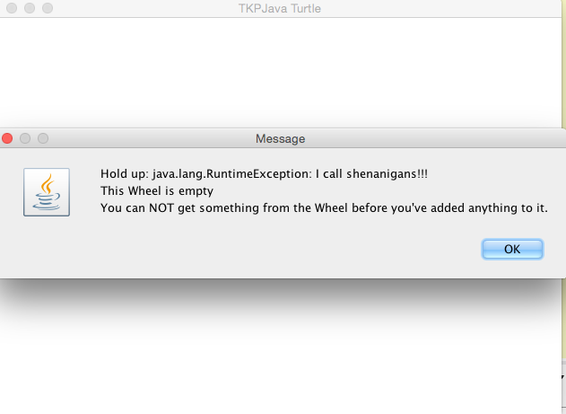

# Teaching TKPJava Course 01 - Intro to Objects 


_Objects, Methods and For Loops_
***
## Preparing to Teach this Course

| Every Course                      | Recipes in This Course             |
|-----------------------------------|-------------------------|
| :hourglass: **Install** the [TKPJava courseware](https://github.com/TeachingKidsProgramming/TeachingKidsProgramming.Java#get-started-with-tkp)   |**1.** Simple Square - [answer](https://github.com/TeachingKidsProgramming/TeachingKidsProgramming.Source.Java/blob/master/src/main/java/org/teachingkidsprogramming/recipes/completed/section01forloops/SimpleSquare.java)           |
| :green_book: **Read** this lesson plan page        | **2**. Simple Square Variation - [answer](https://github.com/TeachingKidsProgramming/TeachingKidsProgramming.Source.Java/blob/master/src/main/java/org/teachingkidsprogramming/recipes/completed/section01forloops/SimpleSquareVariation.java) |
| :computer: **Code** all recipes yourself         | **3**. Simple Square Quiz - [answer](https://github.com/TeachingKidsProgramming/TeachingKidsProgramming.Source.Java/blob/master/src/main/java/org/teachingkidsprogramming/recipes/completed/section01forloops/SimpleSquareQuiz.java)      |
| :bulb: **Review** the [TKPJava Language pptx](http://www.slideshare.net/lynnlangit/tkpjava-teaching-kids-programming-core-java-langauge-concepts)  | **4**. Spiral - [answer](https://github.com/TeachingKidsProgramming/TeachingKidsProgramming.Source.Java/blob/master/src/main/java/org/teachingkidsprogramming/recipes/completed/section01forloops/Spiral.java)                 |
|:fax:  **Print** the [keyboard shortcut sheet] (http://www.slideshare.net/lynnlangit/tkpjava-eclipse-and-codenvy-ide-keyboard-shortcuts) | **5**. Make A Logo - [answer](https://github.com/TeachingKidsProgramming/TeachingKidsProgramming.Source.Java/blob/master/src/main/java/org/teachingkidsprogramming/recipes/completed/section01forloops/MakeALogo.java)             |
|:fax:  **Download and Print** the [recipe worksheet] (https://www.dropbox.com/s/9qwbv48p8lmx4nj/TKP-Worksheets.zip?dl=0) | **6**. Double Loop - [answer](https://github.com/TeachingKidsProgramming/TeachingKidsProgramming.Source.Java/blob/master/src/main/java/org/teachingkidsprogramming/recipes/completed/section01forloops/DoubleLoop.java)             |
|:bar_chart: Keep Learning! | **7**. Deep Dive 01 - [answer](https://github.com/TeachingKidsProgramming/TeachingKidsProgramming.Source.Java/blob/master/src/main/java/org/teachingkidsprogramming/recipes/completed/section01forloops/DeepDive01ForLoops.java)            |


***    
### 
Initial TKPJava Courseware Installation
- Install the TKPJava courseware (on GitHub :octocat:) – TeachingKidsProgramming. by following the one page detailed installation instructions for PC or Mac - [here](https://github.com/TeachingKidsProgramming/TeachingKidsProgramming.Java/blob/master/README.md).
- After downloading per the instructions above then double-click the launcher file (**TKP_launcher.jar** - for Windows) to open the customized version of Eclipse to the TKPJava workspace.
	- If Eclipse doesn’t open at all, you need to install Java or Eclipse or both. Re-read the instructions (on GitHub) to understand how to manually install Java and/or Eclipse plus the TKPJava courseware on either a PC or a Mac.
    - Shown below is an example of how the TKP customized workspace **should** look if the TKP_launcher ran correctly.


***

## Part 1 - **Recipe: Simple Square**

As this lesson is the beginning of the course, it's quite imporant for the instructor to set the proper tone for the student work.  TKPJava is instructor-facilitated via interrogative guidance.

- To start teaching, pair the students (see 'pair programming' in the previous Penflip course), then have the students read the first line of English (comments) in the SimpleSquare.java code file ("Show the Tortoise" -- #1)  out loud.  Line numbers are at the end of each line.
- Use the TKP Intentional method to guide students so that THEY can do the translation.  Refrain from telling them the answer (Java code) in advance.  
- Encourage students to use 'ctrl+space' to get a list of possible items rather than typing out the Java.  Note that **Java is case-sensitive**.
- After the students complete translating each line of English into Java, it is very important to MAKE SURE THEY RUN THE CODE BEFORE PROCEEDING. 
- A detailed example teaching script for the first line is shown below.

### LINE NOTES
   
To get started, we've provided a complete example (teaching script), to give teachers a blueprint for facilitating TKPJava in the Intentional style.

_Say: "Read Line #1 out loud". ("Show the Tortoise")
	
    //  Show the Tortoise --#1
    
Ask: "What is the noun in that sentence?" (Tortoise)  
Say: "Move your cursor to the end of that line and click, to put the cursor there."
Say: "Press and hold the 'shift' key plus the 'enter' key to add a new blank line below the line you are on now for your Java code.."
Say: "In that new line type Big 'T' then small  'or', then press and hold ctrl+space."  

	//  Show the Tortoise --#1
    Tor
    
Ask: " Do you see the word  'Tortoise' in the drop-down list? 
Say: "Click on on that word in the list and press enter to add the Tortoise"

	//  Show the Tortoise --#1
    Tortoise
    
Say: "In English we separate words with a space, in Java we use a period. Type a dot after Tortoise."

	//  Show the Tortoise --#1
    Tortoise.
    
Ask: "What is the verb in that sentence?" (show)
Ask: "How do you get your list?" (ctrl+space)
Ask: "Do you see the verb?  Notice it starts with small 's' " (show)

	//  Show the Tortoise --#1
    Tortoise.s
    
Say: "Click on the verb in the list and then press enter to add the verb." (show)

	//  Show the Tortoise --#1
    Tortoise.show()
    
Say: "How do we end a sentence in English?" (with a period)
Say: "In Java, we use a semi-colon. Type that to end your sentence."

	//  Show the Tortoise --#1
    Tortoise.show();
    
Say: "It is important to to make sure you've translated correctly after each line.  
To test it out, you have to run your program.  To run your program click the (green) play button."
WAIT
Ask: "What did you see?" (A Tortoise!)
Say: "Click the 'X' in the upper right corner to close the window."
Say: "Now we have to clean up our work.  To clean up we will delete the English line that we just translated."
Say: "The easiest way to delete that line is to click anywhere in that line, then ctrl+D."_

Have the students read Line #2 out loud.
Follow a similar process to the detail listed above for Line #1, i.e. ask questions, etc...

 	Tortoise.move(50);

Remind them to run to verify and then to clean up the English that they have correctly translated.

    Tortoise.turn(90);
    
Explain setters and getters - you may wish to show the Getters/Setters slide from the TKPJava-Language.pptx deck to anchor the concept.

_Say: "Setters change something about an object; getters tell us something about an object."_
Choose a student to be an object.
Provide an example, i.e. "Set a student’s position to standing / Get a student’s hair color."  
    Tortoise.setPenColor(PenColors.Blues.blue);

_NOTE: The reason for the use of 'PenColors' rather than 'Colors' or 'Color' is that there is a 'Color' library in standard Java. The TKP 'PenColors' libary includes custom documentation and examples of using the object.  The documentation includes 'color swatches'.  There are also several other Java libraries that include a 'Color' or 'Colors' object.  Having the students select 'PenColors' guides them to using objects in the TKPJava PenColors library._

**For Loop**
_Say: "Read the text  at line --#5.1" (//  Do the following 4 times)
Ask: "Do you see a line numbered #5.2? What is that for?" (repeat - ends the loop)
Ask: "Which line numbers (of code) need to be repeated?" (line x, y, z...)
Ask: "What is the easiest way to repeat?" (copy and paste four times)
Say: "What is the keyboard shortcut to copy? to paste?" (ctrl+c, ctrl+v)_

Have the kids copy and paste the lines 4 times and then run it, then undo back to line

_Ask: "But what if you had to do it 400 times?" 
Say: "Copy/paste over and over, violates the most important rule for programmers – (use your tools). We don’t want to break that rule. So… "_

Introduce 'for' loop synax, you may want to use the TKPJava.pptx slide

To translate, type “for” and then ctrl+space, select the first "for loop template"
 - "array.length" needs to be replaced by the number of iterations (4)
 - DELETE the second line of the array template
 - Move the end bracket down **after** the three lines of code.  Use alt+down, to move the end bracket to bottom of loop code.

    for (int i = 0; i < array.length; i++) { //loop body here }

_Tip: Make sure they run it to verify. Check – easy to mess this one up!_

After eliciting the command, ask: how do we know what is “as fast as possible”? 
Have the students click on the 'setSpeed( )' method and direct them to look at the example in the Javadoc window to see how to assign the appropriate value for speed (10).

	Tortoise.setSpeed(10);

_CONGRATULATIONS! You just made your first program!_

:large_blue_diamond: _Tip: You can use http://virtualproctor.tkpjava.org  from any computer to show student windows on screen when they close their window. We like to run the TKP Virtual Proctor from the instructor's computer and project the screen so that the kid's can 'see' what they are all coding (example shown below)._


Here are some optional lines to personalize the view in the Virtual Proctor

```java
    
    //  NOTE:  see your work at http://virtualproctor.tkpjava.org/
    //  Set your classroom name for the Virtual Proctor --#6.1 (optional)
    VirtualProctor.setClassName("TKPworld");
    //  Set your student name for the Virtual Proctor --#6.2 (optional)
    VirtualProctor.setName("TKPstudent");
```

***
## Part 2 – Variation: Simple Square
To kick off this section, you may choose to use the TKP Kata Question:

_"How would you make a triangle here?"_

See the TKP Instructional Design (Teaching Variation) section for more information.  Here's a graphic that represents the general idea:


This is lead as a ‘follow the leader’ style exercise. Open Word or something to scribble in. Draw a feature grid on your whiteboard as shown below.  Ask your students – what features are there?  Example shown below -  (with all later steps completed):


[Here's](https://www.youtube.com/watch?v=kh8w_plilUU) a screencast (video) on how to teach the SimpleSquareVariation. We've made these video for teacher preparation:

<a href="https://www.youtube.com/watch?v=kh8w_plilUU" target="_blank"> </a>


### Variation Preparation

Intro to preparation
_Any of these values can be changed. But first, we have to get the code ready to be changed, or it’ll end up a mess!_
[Add another column – prepare. Must do these before moving on to other things.]

 - Prepare angle
 - Hard to change right now
 - Go to 90 in code. 90 = quarter of circle. (Spin around.)
 - How do we know that 90 is ¼ of 360? Math. (Or memorization.)
 - Computers better at this than us. What if we want it to turn 1/7 of a circle? What is 360/7? Uhh…
 - Rewrite as 360/4
 - Run, see that it’s the same. [THIS IS IMPORTANT.]
 - Put X in “prepare” for angle.

Prepare sides
Simple refactoring. Go to where it says 4, highlight, right click, refactor, extract local
variable.
Name it “sides”
Run – show that it does exactly the same thing.
[Don’t explain everything here – just show that it runs.]
X it off in the graph.

Prepare line width
Which line determines this? None. It’s a default. So we’re going to make the default explicit.
FIRST LINE IN for loop, add: Tortoise.setPenWidth(2);
Go back to grid, X it off

### Other Variation Notes

[Overall note for variations: try 3-5 numbers, some ridiculously small, some ridiculously big. Don’t use “normal” numbers (20, 100) – use 13, 117, etc.) Don’t go over 1000.]

New column: “Simple changes”
Add one more column: “Cool changes”
Can change anything, but needed to prepare before we mess around.
Variation: sides
Change sides to 7.
Change sides to 13.
Change sides to 100.
Anyone notice a problem?
Lines don’t meet at a certain point. Why? What is 360/13? Fraction! 
Java doesn’t automatically deal with fractions… so change 360 to 360.0 so we’re telling it we’re dealing with fractions.  NOTE: You are introducing the concept of a Double vs. an Integer.

Variation: colors
No refactoring – show green, purple, let them pick a couple of favorites.
Show swatches of color as they arrow down.
Have them find a way to get a random color
Tortoise.setPenColor(Colors.getRandomColor());
Variation: line width
Start with a few small – 5, 8, 13, 75, 347, bring it back to 7
Variation: Move length
99, 9, 23. Check it off. (Just quick changes here.)
Cool changes
Every time we run this it does the same thing. Now, let’s make it so user tells us how many sides to include.
Replace sides = 7 with MessageBox

     int sides = MessageBox.askForNumericalInput("How many sides?");

Run it – show a few options
Show that sides is in black. So is i. These are variables.
In “setPenWidth”, change 1 to “I”.
Ask: what do they think will happen?
Talk them through what’s happening. How wide is line 1? What about the fifth line? The (next one after the largest?) – there isn’t one.
Do a few more – I * 10, I * 3.5

    Tortoise.move(i*5);

Ask about shape: if those were connected, it would be a circle, right? That’s how many degrees? 360. So if you wanted three circles, how many degrees would you need?
(Some student says 1080. “You violated our first rule – let the computer do the math!” So: 360*3.)

You can have the students set their name(s) on their screen in the Virtual Proctor (if you are using it) - at virtualproctor-tkp-appspot.com by having them add the line below (passing in the names of the kids as a String to the set name method of the Virtual Proctor object.
    
    VirtualProctor.setName("LynnAndSamantha");

Put up virtual proctor on screen and let them play with it, seeing what everyone’s doing.


If you are planning to use the Spiral (optional) recipe, then you may want to add a second (nested) for loop in the variation for SimpleSquare, as the Spiral recipe includes this concept, including naming the local variables differently, i.e. 'i' for the first for loop and 'j' for the second for loop.
***
## Part 3 – Quiz: SimpleSquareQuiz.java

To locate the <quiz>.java file, use the keyboard shortcut "cmd-shift-T: SSQ" for (SimpleSquareQuiz) to bring up the Eclipse 'find file' menu

All TKP quizzes are written to let students celebrate their understanding of the concepts presented.  Quizzes are written so that all students who have completed the previous recipes should be able to get 100% correct.

As a teacher, your role is to facilitate (but **not** to give the correct answers!) by guiding kids toward success. Here are some teaching tips for TKPJava quizzes:

- Kids work in pairs, teacher faciliates and helps get to kids 'unstuck' by asking questions.
- Tell kids that they simply enter code matching each recipe line, then run and the quiz will grade that line (those lines) to show whether they passed that line (and the entire test).
- Reminds kids to run after **each** question before deleting the English comment line.
- Don’t show – suggest how they can discover for themselves by asking questions.
_E.g. “What do the English say exactly here?”_
_“That method doesn’t seem to be working for you, is there a different method you could try? .”
“You haven’t gotten question 1 working. Let’s undo and get that working before doing question 2.”_

***

## Part 4 – Recipe: Spiral 

Open “Spiral.java” -   You should point out the 'ColorWheel' object, as this is the first introduction of this object.  

You will introduce the idea of different loop variable names, i.e. 'i' and 'j' in nested for loops.  

Additionally the idea of run-time exceptions is introduced by the deliberate execution path of using colors from the ColorWheel BEFORE colors are added. Having the kids code in the order listed will generate a custom exception in the console window, which is expected and provides an opportunity to introduce the ideas of execution order and null values in a fun way.  We added the Java 'try...catch...' exception handling code to surface the expected runtime exception in a MessageBox (shown below) , in case you aren't running Eclipse in debug mode.  



Tip: Running Eclipse in debug allows you to see any generated exception messages in the Console window by default.

Here is a video recap of the recipe as well -- https://www.youtube.com/watch?v=k1EQTcjcYKM

If kids finish early, they can try variations.  Here's a video showing how to teach Spiral:
<a href="http://www.youtube.com/watch?feature=player_embedded&v=k1EQTcjcYKM" target="_blank"></a>

***
## Part 5 - Additional Recipe: Make A Logo

This recipe continues introducing the idea of using an object _other than the Tortoise_when coding TKPJava.  The new object in this recipe is the 'TKPLogo'.  The TKPLogo object has a number of methods which demonstrate a couple of ideas:

-- Useful, readable method names - ask the class 'what do think this method does **BEFORE** students run the code

-- Reinforcement of tool usage - while method names are English-like, they are not exactly the same as English.  Kids will code _much faster_ if they following this pattern (and do NOT type out the object and method names letter-by-letter):	
		-- Type 'TK... , then ctrl+space, then click on 'TKPLogo' and press enter to auto-complete 
        -- Type a '.' (dot) after the TKPLogo, then ctrl+space
        -- Select the method in the list, press enter to auto-complete it 

-- Introduction of the idea of abstraction.  In a previous recipe (Spiral), kids coded the instantiation of the ColorWheel, i.e. ColorWheel.addColor(PenColors.Blues.Blue); etc...
In this recipe they do not have to do that.  Ask them why not, and also how this same result is achieved. 

Additionally ask about exactly which sets of steps the TKPLogo.draw_tkp_T( ); is performing, i.e. Tortoise.move(x); Tortoise.turn(x), etc... 

You may want to draw the steps out on a whiteboard.  You can also open the source code for the [TKPLogo object](https://github.com/TeachingKidsProgramming/TeachingKidsProgramming.Source.Java/blob/master/src/main/java/org/teachingextensions/logo/utils/TKPLogoUtils/TKPLogo.java) and show the students the amount of abstraction included in this recipe.
***
## Part 6 - Additional Recipe: Double Loop

This recipe introduces the idea of a nested loop and also of using different variable names for loop variables, i.e. 'i' and then 'j'.  It also introduces the idea of 'hiding' the Turtle.  It is designed as a starter to give kids more ideas for variations.  Also via the double-loop they can visually understand 'for loops' more deeply.

Another concept introduced in the recipe is that of translating a recipe which includes mostly English comments, but also some existing Java code.  The reason for this type of exercise is to allow for more complex recipes, but to still keep the number of steps the students complete relatively short.  In addition the complexity of differentiating between English comments and Java code is supported using this partially completed' lesson.
***
## Part 7 – Deep Dive: DeepDive01ForLoops.java
**IMPORTANT** Run each test as a first step. It should fail!  Read the failure output.

Tip: To help kids understand 'how to see what you missed'
This one: http://www.youtube.com/watch?v=vJG698U2Mvo 
Another one: http://www.youtube.com/watch?v=IGQmdoK_ZfY
Yet another one: [McGurk effect] (http://youtu.be/G-lN8vWm3m0 )
Say: _'No matter what happens, you’re going to miss a lot of it. So one way to counteract it is to get everyone to volunteer what they see, even if they think it’s very obvious. (Could be as obvious as a gorilla walking across screen, since someone might not have seen it!)'_

### SETUP
Chairs at front, circle/oval/whatever – computer at desk to the side.
Give kids post-its. 
Each kid writes an observation and the last thing they just did. No talking – they just write. Then collect, and read them to the class.
#### PROCESS
When going through Deep Dive, one student will sit @ computer, another will be standing and will tell them what to type.
After each test, standing student gives observation (/explains why they entered what they did), then they rotate.
If they ask “Does it work if…” then try it and see!
SHOW THEM THE PROCESS
#### numbersDoNotNeedQuotes
Put cursor on method name. Then click on “numbersDoNotNeedQuotes”, run.
Show that it does not work.
Walk them through getting it to work, then have them write observations on it. They read.
#### defaultWidthForTheTortoise
Show failure trace – how do we find the right #?
#### stringsNeedQuotes
Type green
Did not work. Why? Look at the title!
Change to “green”. 
We done? Nope! Must run.
Double click on the failure trace when running the failed program – show the window that pops up.
#### theTortoiseTurns15Twice
How is this different from the last one? (Turning twice, but looking at the angle which results from both turns)
#### combiningNumbers
How is this different from the last one? (Adding numbers, looking for total)
#### combiningText
How is this different from the last one? (Adding strings just combines them one after the other.)
#### combiningTextAndNumbers
How is this different from the last one? (Adding a number to a string treats the number as a string.)
Useful techniques – asking how one is different from the last. (E.g., “assigningVariables” vs. “howFastCanTheTortoiseGo”
#### combiningTextInALoop
Ensure the kids get what happened here. Maybe pick one from audience to explain.
#### forLoopsEndAtTheLine
A fairly advanced thing
Double-click in blue thing. Debug dot.
Now, right click on for loop in left part… sends you to debugger.
Use “step over” (yellow arrow top right) to see individual steps. Show the kids how this works.
#### forLoopsCanStartAnywhere
Same as above – have one explain
#### forLoopsCanSkip
Same as above – have one explain
***


## Part 7 – Worksheet:  To locate '1_SimpleSquareWorksheet.docx' for printing
Download, unzip and print from - [here](https://www.dropbox.com/s/9qwbv48p8lmx4nj/TKP-Worksheets.zip?dl=0) (contains all worksheets for all courses)
Have kids circle part of code, part of English, draw line between them.
Have them go through it – use teacher version for notes.
***


 

