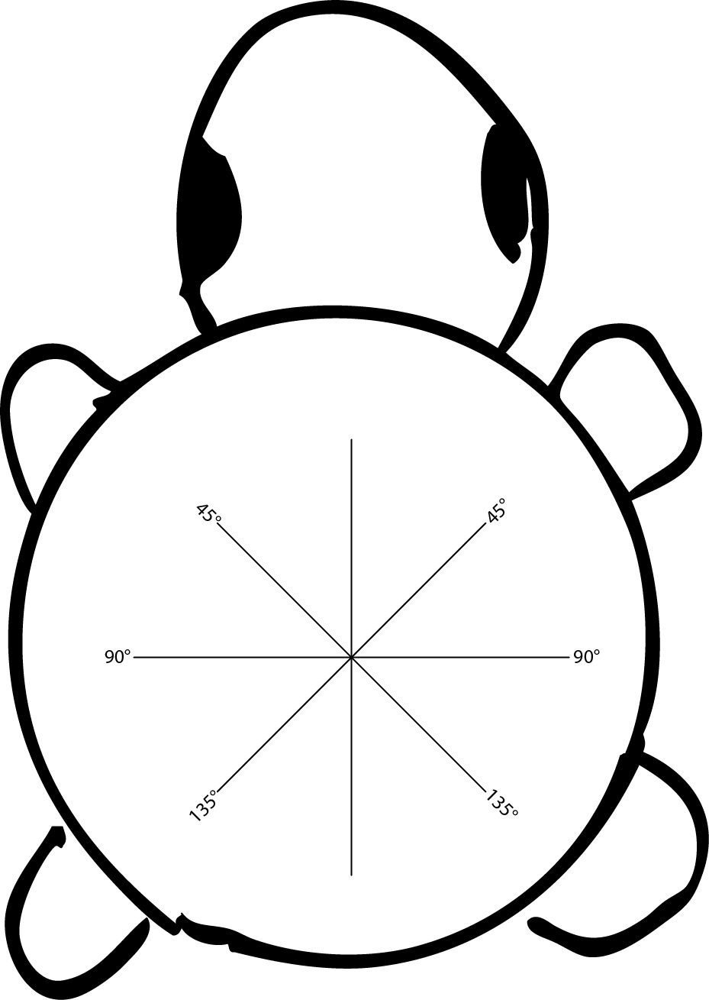
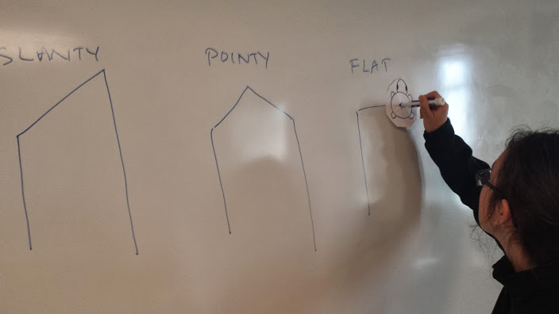
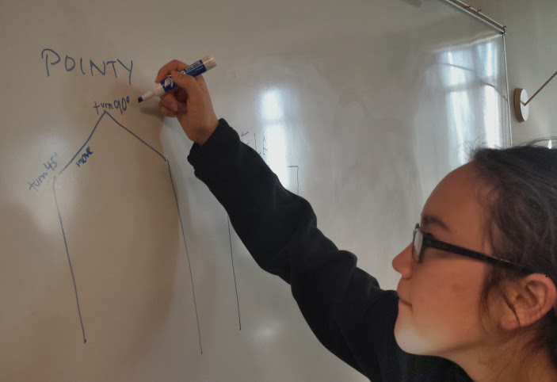

# Teaching TKPJava Course 02 - Methods & Variables

_Using Extract Variable and Extract Method_

***
## Preparing to Teach this Course

| Every Course                      | Recipes in This Course             |
|-----------------------------------|-------------------------|
| :hourglass: **Install** the [TKPJava courseware](https://github.com/TeachingKidsProgramming/TeachingKidsProgramming.Java#get-started-with-tkp)   |**1.** Houses - [answer](https://github.com/TeachingKidsProgramming/TeachingKidsProgramming.Source.Java/blob/master/src/main/java/org/teachingkidsprogramming/recipes/completed/section02methods/Houses.java)           |
| :green_book: **Read** this lesson plan page        | **2**. Houses Variation - [answer](https://github.com/TeachingKidsProgramming/TeachingKidsProgramming.Source.Java/blob/master/src/main/java/org/teachingkidsprogramming/recipes/completed/section02methods/HousesVariation.java) |
| :computer: **Code** all recipes yourself         | **3**. Houses Quiz - [answer](https://github.com/TeachingKidsProgramming/TeachingKidsProgramming.Source.Java/blob/master/src/main/java/org/teachingkidsprogramming/recipes/completed/section02methods/HousesQuiz.java)      |
| :bulb: **Review** the [TKPJava Language pptx](http://www.slideshare.net/lynnlangit/tkpjava-teaching-kids-programming-core-java-langauge-concepts)  | **4**. FourSquare - [answer](https://github.com/TeachingKidsProgramming/TeachingKidsProgramming.Source.Java/blob/master/src/main/java/org/teachingkidsprogramming/recipes/completed/section02methods/FourSquare.java)                 |
|:fax:  **Print** the [keyboard shortcut sheet] (http://www.slideshare.net/lynnlangit/tkpjava-eclipse-and-codenvy-ide-keyboard-shortcuts) | **5**. Triangle Shell - [answer](https://github.com/TeachingKidsProgramming/TeachingKidsProgramming.Source.Java/blob/master/src/main/java/org/teachingkidsprogramming/recipes/completed/section02methods/TriangleShell.java)             |
|:fax: **Print** the main [recipe worksheet](https://www.dropbox.com/s/9qwbv48p8lmx4nj/TKP-Worksheets.zip?dl=0)   | **6**. Pyramids of Giza - [answer](https://github.com/TeachingKidsProgramming/TeachingKidsProgramming.Source.Java/blob/master/src/main/java/org/teachingkidsprogramming/recipes/completed/section02methods/PyramidsOfGizaEnd.java)            |
|:swimmer:|**7**. Deep Dive 02 - [answer](https://github.com/TeachingKidsProgramming/TeachingKidsProgramming.Source.Java/blob/master/src/main/java/org/teachingkidsprogramming/recipes/completed/section02methods/DeepDive02Variables.java)            |

***    
## Part 1 - **Recipe: Houses**

Recipe Concepts
Create methods and run methods.  The programmer way to say run a method is by saying 'call' a method.

Recipe Guidelines
We are introducing the idea of creating a variable (via refactoring) and also of setting the value of that variable (multiple times) during this recipe.  We find it helpful to use the word "current" when talking about variables, i.e. "What is **current** value of the height", etc...

Another teaching tip is to start by assigning a number to the height BEFORE creating the variable.  If you teach this way, remember to have the kids run the recipe each time as you lead them from a number, to a variable name and eventually to a variable which has the current value of the number, i.e. 40.  

Also, lead the students to NOT delete the English comment until AFTER they've completely translated the number into a working variable.  This is an important programming concept, we call it 'fake it until you make it'.

To Refactor: refactor the fake and extract it as a variable, name it “height”.
We have now created line 16: int height=1000
But it is not translating line 15, so move the code to follow the English its translating and replace the fake number with the information we learn: 40

	1.1: Tortoise.move(height);
    1.2: int height = 40;
    
Delete English lines 1.1 and 1.2
This one’s already done now! Run to test, then English can be deleted.
[For 2-8, do them quickly as a class. If they forget to turn numbers negative, just run it and let them be confused. ]

    2. Tortoise.turn(90);
    3. Tortoise.move(30);
    4. Tortoise.turn(90);

Ensure they do this the lazy way! (And the following)

    5. Tortoise.move(height);

Make sure kids are using “height”, not “40”

    6. Tortoise.turn(-90);
    7. Tortoise.move(20);
    8. Tortoise.turn(-90);
    9: sub-recipe

_THIS IS WHERE WE GET TO SOMETHING TOTALLY NEW.
Anyone notice something different about this recipe? – It’s like a recipe within a recipe!_

You can show a short (less than 3 minute) video here to show how to do this.[How to extract a method](https://www.youtube.com/watch?v=C6fnqjceVcs "Method Extraction")

This is a sub-recipe.  When you make a cake, there is the recipe for the whole cake and the recipes for the parts: cake, filling, frosting;

Show them how to extract a method. Highlight from beginning of method to end, INCLUDING comments for  line 9 (top and bottom). Choose Refactor  Extract Method, then use name of sub-recipe: drawHouse.

Delete all the line 9s, run and see that it does exactly the same thing.
When we refactor, code should run exactly the same.

Have kids look at it and try to figure out – what did we just do? Why might this be useful?
Give terminology: method. Why would we do it? If we’re doing the same sort of thing over and over, and want to save typing. Lazy = good. 
Make sure they delete the line 9s!

      10. height = 120;
       drawHouse(height);
       OR
       drawHouse(120);
Before typing – can they see two ways to do this? (hint: one is two lines, one is one)
What might be advantages, disadvantages of each?
Height variable – can be changed more easily later. (E.g., if you want to ask user what height to use.)
120 – less typing.
So a tradeoff, depends on what you want. For now, both do the same!

   	11. Tortoise.setSpeed(10);

Lots of houses to draw, so let’s get this tortoise moving!
Have them do 12-13 by themselves. They know how.

    12. drawHouse(90);
    13. drawHouse(20);
    14. Tortoise.setX(200);

What is the noun? Tortoise.
How are you going to translate this line?  “set-x”
“Get” and “set” is easy mistake to make, happens all the time.

    15. Tortoise.setPenColor(Colors.Grays.LightGray);

They know how to do this and then Run it!
***
### Recap Video: Houses

Focus on creating methods - this is for teacher preparation

***
##Part 2 - Houses Variation

VARIATIONS IN GENERAL
-	_“Tell me the attributes of what we’ve made”_
-	Make grid – brainstorm features (necc. ones below)
o	Height of buildings
o	Width of building
o	Number of buildings
o	Color of line
o	Position of buildings on page
o	Number of sides on buildings
-	Have the kids pick one to change, ask them where it is in the code. 
o	Teaching point: if you see it, you can change it. If not, you can expose it, often by refactoring.

To kick off this section, you may choose to use the TKP Kata Question:

_"How would you make a slanted roof for your houses?"_

See the TKP Instructional Design (Teaching Variation) section for more information.

Idea to get the kids to draw on a whiteboard to show different ways to make a house's roof, i.e. slanted, flat, pointed, etc...  

Print the Tortoise.png file (above) and cut along the lines and put a marker in the middle of the line.

Write the process out that the Turtle draws to make the new types of roof on the board.  

Extract lines that make the roof call the method drawRoof()
Add English to code the method drawSlantedRoof()

Then change the line color using the Tortoise.setPenColor(Colors.getRandomColor());
Then change the background using the Tortoise.getBackgroundWindow.setBackground(Colors.Reds.Red);
***
## Part 3 – Quiz: HousesQuiz.java

-	Warn in advance: this one is complicated, and you will need to be comfortable with some trial and error.
-	Remember, ctrl-Z to undo – your best friend!

***
## Part 4 – Four Square
Uses two for loops and an extracted method
***
## Part 5 – Triangle Shell
Uses two for loops and an extracted method and incrementing a local variable (length)
***
## Part 6 – Pyramids of Giza
Uses multiple levels of method refactoring to remove duplication, i.e. re-factor common code to a method and then re-factor those new methods to yet another new method to remove code duplication.  Also introduces the idea of more than one method parameter (in the second level of refactoring), i.e. final methods have TWO variables.
***
## Part 7 – Deep Dive: DeepDives02Variables.java
More work with variables and variable values, introduces shortcut operators as well (i.e. '++', '--', etc...)
***
## Part 8 – Worksheet: 
Print '2_HousesWorksheet.docx' and have the students complete it.
***

