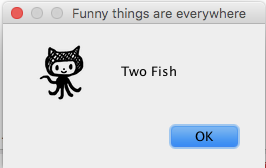
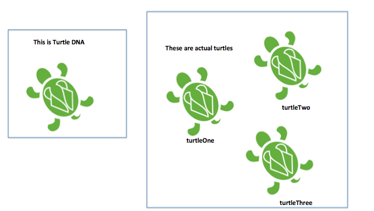
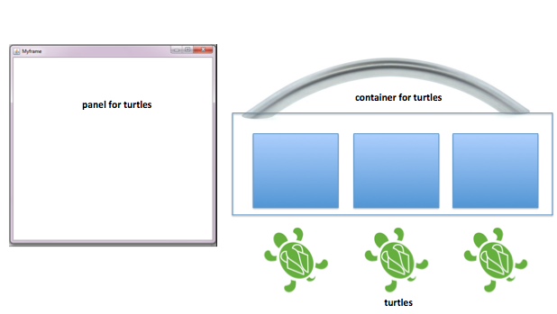

# Teaching TKPJava Course 07 - Objects & Object Instances
(Objects and Object Instances) 

***
## Preparation to Teach this Course
| Every Course | Recipes in this Course |
|--------------------------------------------|--------------------------------|
|:hourglass: **Install** the [TKPJava courseware](https://github.com/TeachingKidsProgramming/TeachingKidsProgramming.Java#get-started-with-tkp) |  **1**. SuperTurtles - [answer](https://github.com/TeachingKidsProgramming/TeachingKidsProgramming.Source.Java/blob/master/src/main/java/org/teachingkidsprogramming/recipes/completed/section07objects/SuperTurtles.java)|
| :green_book: **Read** this lesson plan page | **2**. SuperTurtles Variation - [answer]( https://github.com/TeachingKidsProgramming/TeachingKidsProgramming.Source.Java/blob/master/src/main/java/org/teachingkidsprogramming/recipes/completed/section07objects/SuperSoundingTurtles.java)|
| :computer: **Code** the recipes yourself |  **3**. WhichFish - [answer](https://github.com/TeachingKidsProgramming/TeachingKidsProgramming.Source.Java/blob/master/src/main/java/org/teachingkidsprogramming/recipes/completed/section07objects/WhichFish.java)|
| :bulb: **Review** the [TKPJava Language pptx](http://www.slideshare.net/lynnlangit/tkpjava-teaching-kids-programming-core-java-langauge-concepts) | **4**. CloneTurtles - [answer](https://github.com/TeachingKidsProgramming/TeachingKidsProgramming.Source.Java/blob/master/src/main/java/org/teachingkidsprogramming/recipes/completed/section07objects/CloneTurtles.java) |
| :fax: **Print** the main [recipe worksheet](https://www.dropbox.com/s/9qwbv48p8lmx4nj/TKP-Worksheets.zip?dl=0) | **5**. DeepDive07 - [answer](https://github.com/TeachingKidsProgramming/TeachingKidsProgramming.Source.Java/blob/master/src/main/java/org/teachingkidsprogramming/recipes/completed/section07objects/DeepDive07Objects.java) |
| :swimmer:  | **6** SpiderWebQuiz - [answer]( https://github.com/TeachingKidsProgramming/TeachingKidsProgramming.Source.Java/blob/master/src/main/java/org/teachingkidsprogramming/recipes/completed/section07objects/SpiderWebQuiz.java) |

***    
##Part 1 - **Recipe: SuperTurtles**

- This recipe is the first formal introduction of several key OOP concepts - primary is the idea of objects (classes) and object instances.  This is implemented by using using the Turtle object. 
1. Introduce the idea of Turtle object instances, rather than a single, global Tortoise object (as we've seen in previous recipes)
2. Set the properties for each of the Turtle objects differently, i.e. turtle1 is slow, turtle 2 is fast, etc...
3. Introduce the new window, MultiTurtleWindow.  This is an API abstraction due to way the TKPJava ProgramWindow abstracts arcane Java JPanel commands.  
4. Students will also 'see' the use of a constructor method for the class.

See also the teacher NOTES in the solutions to this recipe (linked at the top of this page.)

There is a video recap for teacher preparation - it is [here](https://www.youtube.com/watch?v=UHyJ53P972I).

## Part 2 - **Variation: SuperSoundingTurtles**
To kick off this section, you may choose to use the TKP Kata Question:

_"How would you play a sound after the crazy turtle draws lightning?"_

We've added a bunch of fun sounds to the TKPJava library!  We added the sounds as .wav files that are exposed via an enumeration on the the TKPSound object.

In this variation, to add sounds, call the 'speak()' method on a turtle instance AFTER you create a new sound like this:

		new Sound(Sound.TKPSound.Ahem);
        myCoolTurtle.speak();
       

## Part 3 - **Recipe: WhichFish**
Recipe covers the following concepts:
- Object instances via the ImageIcon object instances
- Increasingly complex object constructor methods via the newly introduced 'FancyMessageBox' object, which takes a text string, title string and Image Icon instance for the image

- Case Statement

## Part 4 - **Recipe: CloneTurtles**
- This recipe is intended to be used to teach object instances and types of loops (for and foreach).  It contains some complex code (collections, etc...) which students will UNCOMMENT and teacher will introduce concepts.  Collections are taught more completely in later sections of this course.

This recipe is designed to introduce the concept of object and object instance creation.  It also uses several new objects, some are part of core Java, such as ArrayList, while others are part of the TKP Java library, such as MultiTurtleWindows.  

Also there are two different types of loops - for and foreach (the latter is new to the kids at this point).  In addition to this, we add the concept of understanding at what number to start a for loop - showing the first first for loop starting at 1, since it's only used to 'get to' 3 numbers, while the second for loop has to start at 0, since it's used to 'pull items out of the bag of turtles' (perform operation on particular instances of the Turtle object).

We are demonstrating, although not yet coding, a constructor (method) and purposely not starting with the 'main' method.

We did place 'repeat' English lines to show the end of loops, due to the number of loops in the recipe.  We deliberately used Turtle, turtle and turtles - please call out the object or instance and ask 'why is it capitalized (Object) vs not (instance)?' and 'why is it 'turtle' (single instance) vs. 'turtles' (variable name for the bag for the turtle instances)?  
You may want to draw on the board to illustrate the difference between Objects and instances.

Be sure to read/say the English for the 'foreach' loop - 'for each turtle instance of type Turtle that is in current turtles bag do the following...'  Also of note is that in the English comments we deliberately use 'your' turtle and 'your' bag of turtles to help with the translation of object instances (vs. global objects, such as the Tortoise).  We've drawn this graphic, which you may wish to draw on the board when you are teaching this concept.

When you have the kids run the code when you first add the turtle instances from the bag to the MultiTurtleWindow be sure sure to ask 'why is only one turtle instance displayed?' (it's because you haven't yet 'teleported' or moved any of existing three turtle instance off of the default display position (which you do in the next loop), so all three instances are there - they are just on top of one another.

Another area to reinforce is that the second 'for' loop start with 0 and ends with 2 - if you end with 3 you'll get an array index out of bounds error.  A fun first variation is to ask the kids what they would have to change to show 5 turtle instances (which the the counter in the first for loop , i.e stop = 5 and then indexer in the second for loop, i.e. stop = 4).

You might want to point out the drawStar( ) is a convenience method (that is it performs several lower-level operations as a unit) and ask the kids to try to list the steps that are encapsulated.  Drawing a star on the whiteboard is helpful here - ie. turtle.move(x); turtle.turn( ), etc...

## Part 5 - Deep Dive: DeepDive07Objects.java
This Deep Dive reinforces practice with multiple turtle object instance properties.
***
## Part 6 – Quiz: Spider Web Quiz
This quiz reinforces the 'create and extract method [recipe]' concept that we've shown in several previous lessons.  

Also it uses 'bad' variables names on purpose - that is reserved keywords 'number' and 'length'.  Point out that the words are shown in blue because they are reserved keywords in Java.  Lead a discussion on what would be more descriptive variable names for these two variables and emphasize WHY this is the case.

***

