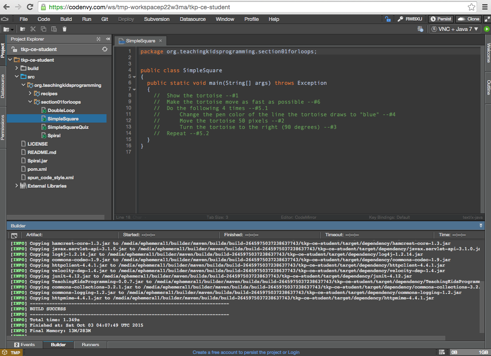

# Teaching TKPJava Beta Test - Codenvy IDE
_What are we testing?_
- Replacing Eclipse with a browser-based code editor or IDE.  Our testing has two implementation types at this point in the testing cycle.  We are currently working with a customized version of a commercial product (Codenvy) for these tests.
- Project 1 = Enabling **K-12 teaching TKPJava lessons** to middle and high school students using customized project instances (via a Codenvy factory).
- Project 2 = Enabling easier **contributions to the TKPJava courseware** library (source files) by professional  Java developers (via a contribution Codenvy factory).

***
##Project 1 - Teaching TKPJava with Codenvy Code Editor/IDE

_Status: You are welcome to try out this customized version of Codenvy now.  However, we are still building this version and **it will change frequently**_

## What is Codenvy and Why should I use it?
Codenvy is a browser-based development environment.  It is an alternative to installing Eclipse and the Java SDK on each student's machine.  The version(s) we are testing also include either the TKPJava.jar file (for students) or the TKPJava source code (for contributors).  We test Codenvy using a Chrome browser on Windows, Mac and Chromebooks.

## How does Codenvy differ from Eclipse?
Codenvy is a cloud-based service that uses different groups of machines on the public cloud for coding, building and running code.  To use the Codenvy product w/TKPJava, you open to a specific website in your browser, rather than installing any software on your local machine.  

Codenvy's functionality is similar to, but not identical, to that of Eclipse - for example Codenvy includes some advanced editor features, such as Intellisense, display of JavaDoc and code formatting,  but it does not yet include support for others, for example code refactoring.

Important: Currently after each build and run of your code, you must stop manually your runner. When you then write new code and you'll start a new runner.

## How do I get Codenvy for TKPJava?  
**For single use** - just click the link in the next section.  This will create one session (or project), which will be active so long as you keep working in that browser window.  When you are done, just close your browser window.  You will see 'TMP' in bottom lower left of your Codenvy project as shown below.

**For multiple use** - first create your user account in Codenvy and then sign to Codenvy.  In another browser tab open the link in the next section.  After the TKPJava/Codenvy environment opens, click the 'persist' button in the upper right and then your environment will be saved by Codenvy.  

***
##Here is the Codenvy TKPJava environment
To try it out, just open the TKPJava/Codenvy customized project (open in a new tab) using this link  -- https://codenvy.com/f?id=dkyfgrsz4kuo8d3x or 
this link --  https://codenvy.com/f?id=plajv4yocf3q0ofz

**IMPORTANT:** To get started with TKPJava and the custom-built Codenvy project instance, you should  [WATCH our video](https://www.youtube.com/watch?v=uTic05IxW5A) and READ the instructions below:

When the project instance opens, you'll want to click on the Project Explorer section to open the first recipe file for editing.  To do so, click on the triangles next to the folders as follows: /src/org.teachingkidsprogramming/section01forloops/SimpleSquare.  You'll see an environment as shown below.  
 

Start translating the English comments in SimpleSquare.java into Java in order of the line numbers at the end of each line of English comments.  If you want to see the documentation for the TKPJava code, you should click on the object or method, i.e. 'Tortoise', then click on Code>Quick Documentation.  You'll see the documentation (which includes code examples) as shown below.  

When you are ready to build and to run your code so that you can see and verify the results, then follow the next set of steps:

1) click on the file you want to run in the Explorer view, i.e. 'SimpleSquare.java'. View the pom.xml file to see which Java file is set to be run.  The default value is 'SimpleSquare'.  To run another Java file, edit line 49 of the pom.xml file with the name of the Java file you want to run, for example  'Spiral' in the classname section will run 'Spiral.java'.

2) click the Run button (small green circle w/white triangle in the upper right) and then wait until you see a  the blue text link (starting with 'http://....')  near the word "Application". When the link text appears, click it to open the result as shown below. 

3) after you click the blue link, a new browser window will open and will show you the output of your code, when you are done, close this window by clicking the small X in upper right **of that window** and then close the browser tab.

_NOTE: If you are using Chrome with a touch screen (Windows or Chrome OS), you may need to set a flag on Chrome to be able to click on items on the VNC (Java) window.  To do this you do the the following:
- From your Chrome browser, go to the internal URL chrome://flags/
- Set the variable named  "Enable touch events Mac, Windows, Linux, Chrome OS" from Automatic (default) to **Disabled**._

4) IMPORTANT: After you close the result windows, then **stop the runner** by clicking on the small red square on the bottom of the Runners panel in the Console tab.

5) As mentioned, a TMP TKPJava/Codenvy factory will be deleted when you close your browser window. To create a saved version of this factory for yourself, you click on the 'Persist' button on the upper right of the window.  This will create a copy for you to access in the future with your work (code) saved.  You access this saved factory, by going to http://www.codenvy.com, logging in and clicking on the factory from your user dashboard or by entering your factory's URL in a browser window directly (assuming your are logged in to Codenvy already).  If you are not logged to Codenvy and you enter your factory URL into a browser, then your factory will be read only.
***
_Known Issues:_

_1. Sometimes the students will get their TKPJava/Codenvy project instance into an **unresolvable error state**.  Always try to 'undo' to get back to a 'good' state.  If this doesn't work, you may see red error indicators in the left margin and the student project may or may not build and run.  Also students may 'lose' Intellisense.  The Codenvy team is aware of this issue and is working to resolve.  In the meantime, teachers should advise students to refresh or reopen their project to fix this._

_2. It appears that the 'error state' (above) occurs when the students attempt to build and run code which has compile-type syntax errors.  These errors are marked in **RED** in Codenvy.  We recommend that you advise students to 'fix all errors shown in red **BEFORE** running the code'._
***
##Project 2 -- Contributing to the TKPJava Courseware with Codenvy for Java Developers

_Status: This project is working and available.  It may change in the future due to expected enhancements in Codenvy itself._

## How do I contribute to the TKP Code Base?
- Click the blue 'Open in IDE' button as shown below from [this page](https://github.com/TeachingKidsProgramming/TeachingKidsProgramming.Source.Java#contribute-to-tkp-java).  

Watch this 5 minute YouTube video to see the Codenvy TKPJava Contribution Code Editor/IDE in action.  A highlight is that using this browser-based editor, you can code, explore, run and extend TKPJava GitHub Repository via the integrated pull-request functionality from within the Codenvy environment.

 - go here -- https://www.youtube.com/watch?v=arZM8muvEfs

