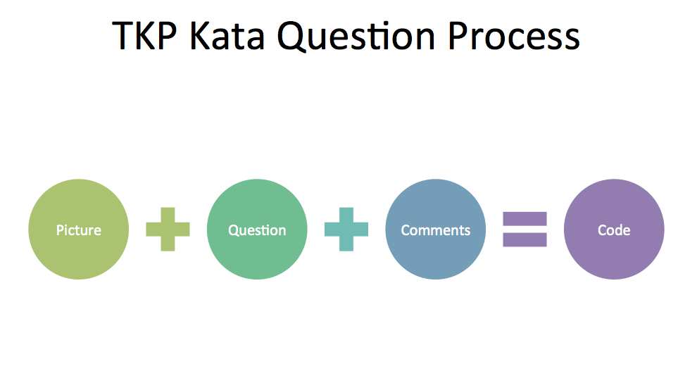
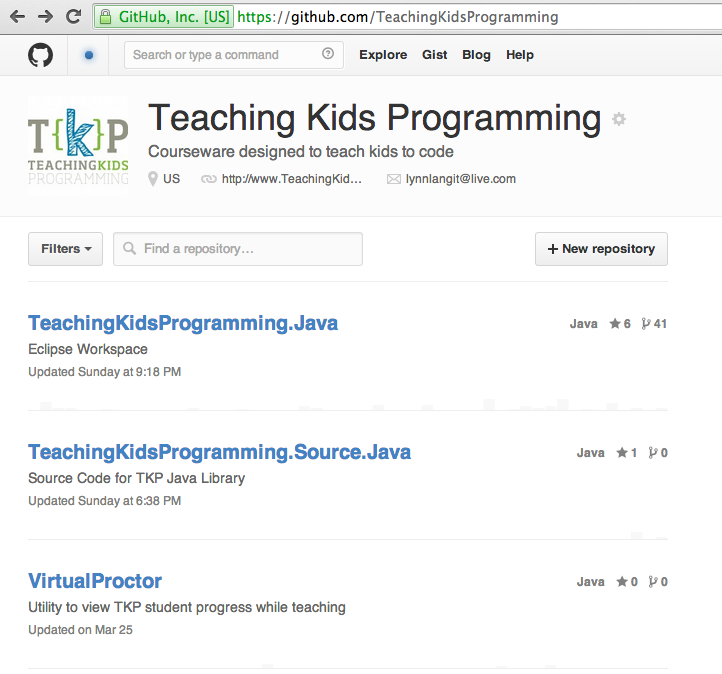
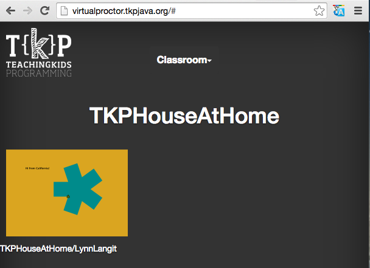

# TKP Instructional Design Information

Topics Covered:

- 5 Steps to teach TKP Courseware
- About The TKP Intentional Method
- What are the Parts of each TKP Course?
- How TKP uses Agile Technical Practices and Terms
- Why Pair Programming
- Why Group (Mob) Programming
- TKP Classroom Management Tips and TKP Virtual Proctor Utility
- Guide to TKP Java courseware and source code on Github
- Guide to Authoring TKP Recipes
- TKP courseware for other computer languages - SmallBasic, C#, T-SQL and more
- About TKPJava and the APJava Exam

***
## 5 Steps to teaching TKP Courseware

TKP Courseware is designed to be **instructor-led by K-12 teachers** (middle school is our core audience).  TKP teachers do not need to be professional Java developers, but they should expect to learn programming by completing the TKPJava courseware themselves prior to teaching it. TKP Java Courseware is a set of custom Java (code) libraries, teacher lesson plans (GitHub) and YouTube screencast videos.  

_Note: If you are familiar with coding in Java, you can start by directly downloading the **TKPJava** code and Eclipse editor settings from Github (detailed desktop installation instructions on Github) :octocat: [here](https://github.com/TeachingKidsProgramming/TeachingKidsProgramming.Java/blob/master/README.md)._

Listed below are the steps to prepare to teach TKP courseware:

1. **Read about TKP Instructional Design Methods**.  The core information is on this page.  There are links to more detailed and background reading on this page.

2. **Do the recipes / lessons in the course you plan to teach as a student**.  This means coding the lessons in an editor or IDE yourself.

3. **Practice teaching to one or more students (kids or adults)**.  Particularly if you are new to programming, TKP teachers report practice teaching to a smaller group in advance of the 'main' class helping them to be more comfortable teaching.

4. **Review the available resources for each TKP course.**  Resources include written explanation, mostly line-by-line for each course in GitHub, also recipe answer files.  Additionally some recipes have answer videos on YouTube.

5. **Use TKP Utilities.** Our current utility is the TKP Virtual Proctor / website, which allows you to 'see' student's work from one browser window at `http://proctor.tkpjava.org` 
***
## About The TKP Intentional Method

We at TKP have created and use a new method of teaching children programming. We call this the **intentional method**. Our work consists of customized courseware and teaching techniques. 

:red_circle: **CORE IDEA:** _The Intentional Method is teaching by guiding kids (working in pairs) to translate English comments (the intention) into runnable code. The principal programming language that we use is Java._

We have created small experiments using the Intentional Method in other languages.  These include Microsoft SmallBasic, T-SQL and for Microsoft Kodu (visual programming).  We are also working on some IoT (Data) projects.

There are a few key concepts that we attempt to follow in writing and in teaching all our TKP courses.  These concepts include the following:

1) **One line of English = One line of code** - exploration of API via Intellisense is a key aspect here.  We've paid careful attention to 'leveling' using both our our TKPJava API to 'wrap complex core Java concepts' and also creating a set of standard English comments to represent common Java concepts, for example in 'Set the value of the current length to 40', we are deliberately using 'current length' to indicate that the student should first search via Intellisense to see if a variable named 'length' is already in scope, and if not, should create a new variable of that name.

2) **Code one+ line(s) and then run your program to verify** that your translation was correct (lessons are meant to be completed in a specific order (and have line numbers at the end of each line to indicate that order - multi-part lines are numbered 1.1, 1.2, etc..

3)  After verification, delete that line of English comments.  Our lessons and API are meant to be discoverable by the students (with direction by the teacher).  The teachers should encourage the students to use Intellisense (Ctrl+Space, or Cmd+Space) and to read the drop-down list of available items to see which one matches the English.  Teachers should **NOT** type the Java code before the students do so.  Teachers should **NOT** have the students copy the Java code from the board, rather they should ask the students to read the English comments aloud if students are stuck.  Teachers should also direct students to read/use examples in the Javadoc.  **Teaching API exploration and use of tools is a key aspect of teaching TKPJava**.

:pushpin: Note: For Teacher Preparation only, we have added the 'answers' to all course lessons to the source GitHub Repository at this [location](https://github.com/TeachingKidsProgramming/TeachingKidsProgramming.Source.Java/tree/master/src/main/java/org/teachingkidsprogramming/recipes/completed) 

4) **Concept mastery via multiple methods** of use - there are 6-8 recipes (lessons) per course which cover the particular programming concepts being taught in deliberately duplicated and increasingly complex ways.  We design courseware that is carefully leveled and paced for students to learn and master 1 or 2 new computational concepts at a time.  Below is a graphic which shows the parts (lesson types) in each TKPJava course in suggested order of teaching, i.e. the top level item (recipe) is designed to be first lesson taught in a course, etc....

Here is a 20-minute welcome video for K-12 teachers on how to use TKPJava courseware resources.

---

## What are the Parts of each TKP Course?
1) **Recipe** – This is a **teacher-led** coding lesson (recipe) that teaches 1-3 programming concepts, such as 'what is a class or a method?'  Intended for students to pair program as directed by the teacher, translating one line of English into one line of code and then running the program to verify the correct translation after each line is translated.  

Recipes are written to be translated and run in a SPECIFIC order.  This order is indicated by the line numbers at the end of each line of English comments.  The reasons for the ordering are as follows:
- Introduce concepts one by one (sometimes directly reinforcing with repetition)
- Slow movement away from one-for-one English comment (meta) language to TKPJava libary (term) language.  In other words, we start with direct matches, i.e. 'Show the Tortoise' becomes 'Tortoise.show( );' and move toward less direct translation, i.e. 'Make the Tortoise move as fast as possible.' becomes 'Tortoise.setSpeed(10);'.  We include customized Javadocs with examples to support the student's ability to discover the correct translation.  

In some recipes we also deliberately introduce run-time errors and throw custom error messages, to further reinforce use of documentation while coding.

Recipes are supplied as a Java class file with method stubs which includes the English for each line of code that the pairs will write.  Each Java class file also references pre-created Java objects, i.e. Tortoise, etc.. and is presented as  one .java file per recipe, for example SimpleSquare.java.

:pushpin: See section on "Pair Programming" later on this page for more complete explanation.

 :pushpin: Teacher prepares to teach each course (in advance) by watching the TKP Recap YouTube video for the recipe that the pairs will complete. Teacher can pause the video and ask the students questions about the code in order to verify student understanding.  Videos are found on the [TKP YouTube channel](https://www.youtube.com/user/tkpjava/playlists) and have the same name as the recipe, i.e. ‘Simple Square Recap’.  Recap videos are 10-15 minutes long.  We also have created a simple PowerPoint deck which you can use to reinforce core Java language constructs (pictured below) - you can download it from [here](http://www.slideshare.net/lynnlangit/tkpjava-teaching-kids-programming-core-java-langauge-concepts).

_

2) **Recap** –  At this time students flip over their keyboards (or close their laptops) and observe as the teacher does the recipe the kids just coded him/herself.  The teacher leads this section by using the Socratic method (i.e. asks the kids questions, such as 'What do I type now?' or 'What is keyboard shortcut for this action?', etc...)  and codes the entire recipe again, while the kids answer the questions and watch.

:large_blue_diamond: Tip: Teacher should purposely make mistakes, such as adding extra parameter values, or leaving off closing braces, or omitting ending semi-colons and then ask the class 'How do I fix this error?'  Also teacher should reinforce use of keyboard shortcuts, by asking students 'What is the keyboard shortcut to do action a, b, c (to delete a line, to compete a term, to perform a QuickFix, etc...).  Below is a list of keyboard shortcuts for both Eclipse and Codenvy Java IDEs (editors).

3) **Variation** – Teacher leads this section, students work in pairs.  Teacher should ask students to name the properties of the completed recipes shape or output (for games), i.e. line length, line width, etc…and should write on the white board as a grid (see example for SQUARE recipe below).  Teachers should should verbally guide pair of students in coding changes.  Changes should start with simple changes, i.e. change variables from one constant value, such “blue” to “red”, then progress to complex changes, such as Colors.Red to Colors.GetRandomColor(). Written instructions on how to lead variations are found in each Course (Lesson) plan for the teachers.  Teachers verbally lead students as described above.  

:large_blue_diamond: Tip: Teacher can use one or more TKPJava 'Kata Question(s)' to 'kick off variations.  The idea (shown below) is to ask a question about the result of the recipe to get the students to visualize (draw), formulate (question), decompose (write and place English comments) and then to translate (code) to create the results.

We've created a short video which elaborates on this process as well.  It is found [here](https://www.youtube.com/watch?v=eSxPP9NZzZ0).  Additionally, in each course we've added a 'Kata Question' at the beginning of the variation section.

Each course will include a sample variation grid, an example is shown below.  The variation grid is meant to be a starting point for this section of the course.  It is common, and desirable, that the pairs will experiment and explore beyond the basic variations that the teacher introduces.

### Sample Variation Grid

| Feature | Value | Refactor  |
| ------ | ------ | -----: |
|  Sides  |  5  |   no  |
|  Length  |  i  |   no  |
|  Color  |  ColorWheel  |   no  |
|  Rotation  |  1  |   no  |
|  Width  |  1-4  |   no  |
|  Background  |  SolidWhite (default)  |   expose default |
|  Number of LInes  |  200  |   no  |

During the Variation portion of each course, the teacher reinforces code refactoring.  TKP courses commonly include the following type of refactoring (used both when teacher is teaching the core recipes and also during variations):

### Sample Types of Refactoring used in TKP courseware

| Type | Example Usage | Keyboard shortcut |
| ------ | ------ | -----: |
|  Rename  |  renames object  |   Alt+Shift+R  |
|  Extract local variable  |  expose default value  |   Alt+Shift+L  |
|  Extract local variable  |  make value variable and reusable  |   Alt+Shift+L  |
|  Extract method  |  pull out portion of existing method logic, usually for eventual reuse  |   Alt+Shift+M  |
|  Add comments  |  (advanced) used to add comment markers  |   Ctrl + /  |
|  Inline variable  |  (advanced) used to improve code readability |   Ctrl + 1  |

4) **Quiz** – Teacher should explain the format, i.e. translate one line, then run it to see if you got it right and then ask each pair to work together to compete the each line (or question) of the quiz correctly. Teacher is a **facilitator** in this section.  

If the pair is stuck, then the teacher should guide the pairs to discovering the answer by having them re-read the line of English or to use the Eclipse editor to explore and to read the documentation (including the example usage of the objects shown in the documentation - such as ColorWheel.addColor(Colors.Blues.Blue); ).  

Teacher should encourage kids to run their program after they’ve translated **each** question.  Teacher should remind pairs if they are stuck to use ‘UNDO’ to get back to a working state.  Teacher should try to avoid telling students the correct answer, preferring instead to guide the pairs so that they can discover the correct answer themselves.  

The quiz for a recipe is found in the CourseNumber folder of the TKP workspace, i.e. Course One w/Simple Square Recipe includes a Java stub file called Simple Square Quiz.  Quizzes are named with the same name as the recipe, i.e. SimpleSquareQuiz.java and consist of a class with method stubs and English to be translated by the pair of students.

:pushpin: _Note:  TKP Quizzes are NOT designed to be graded by teachers.  They are designed to allow student pairs to demonstrate (and enjoy) concept mastery.  Quizzes are designed so that ALL students can get ALL questions correct._

5) **DeepDive** – Teacher should demonstrate only the first couple of deep dive questions as a group. In a deep dive, each method is a question.  Teacher should encourage pairs to change ONLY the underscore characters when they are trying to get the method to pass its test. **IMPORTANT** Model running each test FIRST - it should fail and direct kids to read the failure output.  Then change ONLY the underscore to make the test pass.  Run that test to verify that it passed (result will be a 'green  bar' in the test runner JUnit).

Teacher should use the same steps as for the Quiz to facilitate leading the kids through the DeepDive exercises.  Students can work in pairs or in a Randori format (Randori is also called 'Mob Programming').  It is suggested to have the pairs rotate after getting each method to pass.  If using a Randori format, the students should rotate after each successful test run.  In either case, the teacher should encourage to share at least one thing s/he learned in the getting the method test to pass. 

:large_blue_diamond: Tip: Here's more information about 'Mob Programming' - http://www.agileconnection.com/article/mob-programming-whole-team-approach

The deep dives are found the in the Course Number folder of the TKP workspace for the current course, i.e. CourseOne, CourseTwo.  They are numbered to match the TKP Course, i.e. DeepDive01.java, etc…they are designed to be run with the test runner in Eclipse and include English instructions at the beginning of the Java file on how to use keyboard shortcuts to run the file using the JUnit test runner.

6) **Worksheet** -  TKP courses include printable (paper) worksheets.  The goal of these handouts is to let teachers reinforce the key programming concepts (particularly terminology - such as classes, methods, variables, etc...) that have been introduced in each course by asking the students to identify or count the occurrences of particular types of those objects in the recipe solutions and record their answers on a written worksheet.  You can download the worksheets from [this location](https://github.com/TeachingKidsProgramming/TeachingKidsProgramming.Source.Java/tree/master/src/main/resources/documents).

7) **Xtras** – TKP courses have additional ‘mini-recipes’ included, such as the SPIRAL, which a teacher may use when teaching the SQUARE.  These are 10-15 minute, fill-ins.  They give the pairs who finish the guided work (quizzes, deep dives) before others something else to do.  Teacher can have the pairs work on these ‘fill-ins’ on their own during guided teaching time or they can ask individual students to complete this supplemental work during free class time or at home.  

Here is a list of all courses and materials.  The list also matches computational concepts taught to TKPJava activities.  And it lists the preferred method of teaching each activity (i.e. lead, facilitated, students in pairs, students in a mob, etc...). Items in yellow are in active development as of Jan 2016.

Here is a video of a talk w/code demos of TKPJava that Lynn Langit gave on TKP courseware design at Oredev in Malmo, Sweden in Nov 2014.

***

## How TKP uses Professional Programming Practices 

TKP instructional design is based on many Agile (and XP or Extreme Programming) best practices and principals.  These include use of core Agile practices in the teaching (or delivery) of TKP courses. TKP courseware includes examples of using these practices in classroom situations and suggestions on how best to incorporate these practices into teaching children to program. They include the following:

* **Pair Programming** – both the students and the teachers work in pairs to learn / teach TKP material if possible.  TKP courseware can be taught by a single teacher, however we recommend team teaching if possible.  For the students, this means 2 students for 1 computer - one typing, one telling (what to do), rotate on time (usually 5 min) or task (i.e. when a line or section of code is completed successfully).

* **No Big Upfront Design** – teacher is advised on how to guide the student pairs to writing and executing their first program within 5 minutes of the start of each TKP class.

* **Test-driven development** - courseware is written so that students can be guided to translate one line of English into one line of code and then to run (or execute) the result, so that pairs can observe whether they have successfully completed the translation. This is a type of visual test-driven development. Also the TKP teaching method advocates deleting the original English comments AFTER the line has been properly translated.

* **Sustainable pace** – careful attention should be paid by the teacher to the pace of the class.  Student pairs are rotated (within pair) either on task completion or on a regular time interval (such as 5 minutes).  Pairs are also switched at the end of each lesson (if that day’s class is a multi-lesson class), to further facilitate knowledge transfer.  TKP courseware is designed to be taught via mastery-based learning - that is that every student masters every concept in each course, before the next course is introduced.

* **Rapid Feedback** -  In addition to the immediate visual feedback that the children get after they run each line of code in the recipe, the TKP group advocates the use proctors (helpers) in the classroom to keep the pairs on pace. In addition to live proctors, the TKP courseware includes a Virtual Proctor, which provides visual feedback from all of the student pairs to the teacher.

* **Craftsmanship** – each recipe or lesson contains several sections, so that students can master concepts taught, APIs and tools before being introduced to new concepts, tools and APIs.  This is also called 'mastery-based' learning as mentioned previously.

* **Randori** – a method of teaching a group with one computer and one projector.  The group sits in a circle and rotates each time a task is successfully completed (coded).  One person is at the keyboard typing (driver) and one person is telling the driver what to type (navigator).  The group can assist the navigator if that person is unsure or 'gets stuck.'

* **Code Kata** – a method of teaching by providing higher level abstractions to define the problem to be coded.  For example 'make a square' (kata) vs. more explicit (usually line -by-line instructions) such as 'show the tortoise, then have the tortoise move 50 pixels, then have the tortoise turn right, then do that 4 times.'  Code Katas more closely resemble real-world software requirements or user stories, than do line-by-line English instructions.  The process of translating, or breaking down, higher level concepts into English FIRST and then writing the program code to execute each of those English instructions one line at time (and testing for correctness by running the program or a test) is key to the TKP Intentional method of teaching how to program.

* **Code Koans 1** – a method of teaching which uses both coding and retrospection to teach programming concepts, TKP particularly uses koans (called 'deep dives') to explore programming concepts in further depth.  An example is in the SQUARE/CLASSES course, the concept of a 'for' loop is introduced.  In the CLASSES/deep dive, the exercises include coverage of optional components of a 'for' loop, such as step value.  

* **Code Koans 2** –TKP Koans are also based on the test-driven development concept of unit tests.   A unit test is a method which is written to compare the expected and the actual output values of another method.  Unit Tests are often written with the 'assert' method.  TKP Koans use both the standard 'assert' methods as well as the 'verify' methods which are part of the included ApprovalTestsLT library.

* –**Code Koans 3** –Yet another way to understand Koans is as a form of 'learn by hacking' - literally student pairs are encouraged to 'hack' (or guess) to try to get the correct answer (or the unit test to pass [or produce a 'green bar']).

* **Code Koans 4** –A key component of working with TKP Koans is that the facilitator/teacher should ask each pair of students to reflect on what they have learned EACH time they get a method to pass.  Students will observe a variety of things about the language, environment, test harness, etc...facilitators may want to capture student observations on a whiteboard, flipchart etc. during this part of each TKP course.
***

## Why Pair Programming

A common misconception that comes up is when a student or teacher see two individuals on one computer they think of it as an inferior way of learning. This is not the case and here are the advantages demonstrating how paring is a good way of learning. Before explaining why pairing is a good way of learning, we will explain the paring technique we use.

### Technique:

Pairing technique takes the form of one student at the keyboard and the other student sitting beside her.  The student at the keyboard (driver) is taking directions from the student beside him/her (navigator). A simple timer (we often use our phone) is used to regulate the rotations, usually 5 minutes, but can vary, sometimes 'rotate on task completion' fits better.  If there are two teachers, they should also rotate to model pair programming.  Examples of alternative methods of rotating the student pairs, are rotating on task success (such as during the TKP Quiz or TKP DeepDive).

### Methods:

#### Setup:
Pairing allows twice as many students per computer. It reduces the amount of computers the teacher must set up, although it is very important to keep in mind the classroom will need the same amount of chairs compared to the number of students.

#### Class unity:
Unity is important because it allows the class to be on the same page. It is harder to have unity when students are working independently especially when it involves a large group of students. Pairing affectively reduces the amount of independently working students by ½.

#### Skill equalization:
Students come in with different skill levels, making it difficult for a teacher to teach them simultaneously. The teamwork pairing offers helps to level the playing field for all the students. The best part is that it does not penalize the more advanced students because as they explain the material to their classmates, they gain a deeper understanding.

#### Focus:
Working with a partner helps both students to keep their energies focused on coding and reduces distractions (i.e. web browsing, etc...).

#### Social:
Pairing offers a more friendly and sociable atmosphere, which we hope to dispute the misconception that programming is associated with being anti-social. This is especially important for girls, who usually work better in groups where they are able to communicate and discuss with one another.

#### Reduces frustrations:
In programming, encountering bugs cause a huge amount of frustration for everyone. When students are individually working, it is easy to overlook bugs or mistakes. However, with two pairs of eyes attentively working together, the amount of bugs or errors present are greatly reduced. Often times a concept may be confusing to one of the students in the pair, but not the other. By working together their frustrations are reduced.

#### Body Chemistry:
Rotations are implemented by the teacher because after 15 minutes of sitting down, one’s body chemistry shifts and slows down. By requiring the kids to **stand up** every 15 minutes, we help prevent this shift in their body from taking place. This is the reason behind why the teacher should refrain from just letting the students pass the keyboard over when it is time for the pairs to rotate.

#### Greater peripheral vision:
According to cognitive science studies, negative emotions hinder one’s ability to engage in broader visual perception. (http://www.unc.edu/peplab/broadening.html )
For example, a study tracked the duration of time people spent looking at a picture according to their emotional state. The more unhappy one is feeling, the less likely the individual will be able to see the entire screen. It is difficult to learn when one is not able to be able to see options available to them.

#### Creativity:
Studies in cognitive science have also presented the fact that one’s creative abilities may be limited when working in solitude.  (http://ascc.artsci.wustl.edu/~ksawyer/groupgenius/ ) However, creativity is able to flourish when one is given the opportunity to bounce ideas off others.

#### During class
Kids all working in pairs unless otherwise noted. At 5 minute intervals (use a timer), pairs get up switch roles. One types, while the other tells the typist what to do. An example is shown from a TKPJava class below.  

:pushpin: Below is an example of two kids pairing while learning TKPJava.

***
## Why Group (Mob) Programming

Another method of teaching we use is group (or mob) programming.  This is a process with one computer, which is attached to a projector.  One student sits at the keyboard ('the driver') and types what one other students who is standing ('the navigator) tells that student to type.  The rest of the students sit in a circle of chairs around the driver and navigator.

For each coding problem, first the navigator tries to solve it.  The driver types what he or she is told to type and then runs the program to verify that the result is correct. Next the teacher (who is acting as a facilitator during this process) asks BOTH the driver and navigator to share at least one aspect of coding, tools, language, etc... that both learned by solving the problem.  The facilitator can optionally record the student's information on a whiteboard or flip chart.

After a problem is solved, then the students all **stand up** and rotate in the circle, so that every student will have at least one turn as driver or navigator during the exercise.

For more about the benefits of mob programming, see this reference -- http://en.wikipedia.org/wiki/Mob_programming
***
## TKP Classroom Management Tips and the TKP Virtual Proctor Utility

We included this section for teachers of our courseware who are new to leading a classroom full of kids.  Experienced K-12 teachers may wish to skip this section as they probably are familiar with the majority of these techniques.

#### Small steps

 - Translate the next line that you can see the result of execution – you will guide them through the recipes in the order that can SEE the results, NOT in 1,2,3 order.  All of our recipes have suggested line orderings on the English lines for teaching, i.e. teach line 2 first, teach line 5 second, etc…

 - If a single line isn’t viewable, use ‘Fake it till you make it’ to allow interim translations  i.e. Place the Circle where the mouse is  (you don’t have a circle, which needs a radius, or a mouse)ShapeMaker.CenterShapeAt(ShapeMaker.CreateCircle(20), 20,20)  “ok, this puts a circle on the screen, now lets work on it being the correct circle, and using the mouse locations…”

**Instructor typing**
 - Always type *just* enough to show the documentation that would be the most helpful to the kids.
 - If they are looking for something that the tortoise should do, type<Tortoise.> so that the list of methods comes up on the side.
 - Give the kids time to explore the documentation.
 - Always wait until most of the pairs have got working code (look at virtual proctor results) before the instructor types out the code and runs it.
 - It’s ok to be quiet for a while and let the kids work. No, really.
 - It’s great to occasionally make a mistake when the instructor types,either by typing exactly what the example/documentation says and thencorrecting it because what we need is slightly different (SetPenColor(“red”) / For i = 1 To 10), or to get something that doesn’t compile (e.g. during the recap, try typingTortoise.Turn(left) and then when it doesn’t compile, point out the line number and the helpful error message, and then to the documentation on the side again).

**Guide — don’t tell**
 - Ask the kids to read the English lines out loud – use this technique frequently.
 - If kids are stuck, have them re-read the relevant line in English.
 - Exploration, have the kids use the arrows to figure out what to do. If they don’t know where to start Ctrl+Space will list all possibilities.
 - If someone asks “is this right?”, tell them “run it”.
 - If they want to know which method, point out the documentation.
 - Resist the instinct to tell them the right answer, but help them to keep moving.
 - Watch to see both members of the pair are contributing, if not, prompt the non-participating member of the pair to ‘jump in there’

### Create and use save points
 - At least at the end of each recipe, everyone must save their work
 - To revert to the beginning of a lesson quickly, go to the Navigator in Eclipse, right click on the Java file and then click on ‘Revert using local history’ and then click on the first entry, this will re-set the lesson back to the start point

### Recaps
	 - Point out nuances of the editor, the documentation, the logic, the shortcuts as you go.
	 - Use this time to Explain the Concepts they have just Experienced.
	 - Introduce Programming Lingo, .i.e for SQUARE say ‘nouns are Objects and are shown with Cubes; verbs are Operations and are shown with Wheels, etc…
	 - This is a good place to do a scoping diagram (list Objects, Methods and Variables you have used)
	 - Here is a good place to make mistakes on purpose, such as “Tortoise.SetPenColor (blue)” and have the kids tell you how to correct those mistakes

#### Coding (Debugging) Tips 
	 - UNDO: Advise the use of undo first
	 - FORMAT: we have set Eclipse to automatically format on save.
	 - METHODS (Operations): check parenthesis pairs and arguments — have the kids click on the method (word) in the editor and then read the documentation — particularly the example.
	 - BLOCKS: check for { } placement and/or missing { }
	 - STRINGS: check for double quotes
	 - ENDLESS LOOPS: undo back to a runnable state, this is usually a result of putting a string in the arguments for a loop
     - DEBUGGER: Use the Eclipse Debugger - here's a short YouTube screencast on how to do this - https://www.youtube.com/watch?v=M8F6ziuccmw

#### Pairing
	 - Adjust “double-slow” pairs with fast kids; make sure to rotate a pair that falls behind continually.  Do not pair siblings.  If adults want to take the class, pair the adults together.
	 - Backseat Drivers: if a kid who should be navigating is typing, then interrupt, and remind the kid that they can NOT touch the keyboard when they are navigating
	 - Rotate teachers same as kids
	 - Rotate every 5 minutes or at task completion
	 - Make them stand up when rotating, this simple movement helps with energy and attention.
    
#### Energy
	 - Kids should be typing within 3 MINUTES of class starting.  It is very important to start the class off with action quickly.
	 - Ask the kids LOTS of questions, all of the time.  Don’t tell them, ask them – it’s critical to keeping them engaged.
	 - Encourage barely controlled chaos — noise is good, students should be talking/laughing;
	 - During Variations kids should be joyful.
	 - If teaching after lunch, spend extra time pumping up the energy before sitting down.
	 - Switching seats should be a high energy activity.  Do NOT raise hands BEFORE doing this, as it lowers the energy in the room.
***
## Guide to TKP Java courseware and source code on Github

The courseware is open source.  The teaching version (to be installed on the student computers, consists of a Java .jar file and some utility files.  The teaching version of TKP courseware is found in the Github :octocat: repository named [TeachingKidsProgramming/TeachingKidsProgramming.Java.](https://github.com/TeachingKidsProgramming/TeachingKidsProgramming.Java) 

#### About the TKP Virtual Proctor Utility

In addition to the courseware, TKP has two related repositories on Github. The first one is named [TeachingKidsProgramming/VirtualProctor](https://github.com/TeachingKidsProgramming/VirtualProctor).  This is a simple application that we use to help us to monitor the progress of the students in the classroom.  To use this utility, just open a browser to `http://proctor.tkpjava.org`  
By default the TKP VirtualProctor takes a screen shot of the program (graphics) windows AFTER the student closes the window and sends that screenshot to a cloud-based service.  The associated website displays the last screenshot with the default name of the computer. 
To configure the VirtualProctor with a customized student name from a student's machine, add the following line of code to any TKP recipe:

        VirtualProctor.setName("studentsName");
		VirtualProctor.setClass("classroomName");
   
  After you add this line of code, then run the code and close the program (graphics) window.  The TKP Virtual Proctor contains an automatic refresh interval.  You can drag and drop the screens around on the browser page so that the screens match the physical classroom layout.  A sample output is shown below.
  
 

The source code for the APIs that we wrote to use in the TKP courseware is found in the Github repository at [TeachingKidsProgramming/TeachingKidsProgramming.Source.Java](https://github.com/TeachingKidsProgramming/TeachingKidsProgramming.Source.Java).  Here you can see which APIs we wrote (or extended) in creating the courseware.  Also of interest to teachers in this repository may be [the completed recipe (or answer) section](https://github.com/TeachingKidsProgramming/TeachingKidsProgramming.Source.Java/tree/master/src/org/teachingkidsprogramming/recipes/completed).  We deliberately obscured the location of the answers, as we do not want students to copy and paste the answers, rather we'd prefer that they explore the API, and with teacher guidance, code the results themselves.
***
## Guide to Writing TKP Writing Recipes

We put a great deal of effort into creating recipes.  We test and iterate constantly, so that kids will have a great experience learning.  Some of the core concepts we try to follow when creating recipes are as follows:  

1) Recipes should be FUN and ENGAGING  
2) Recipes should be able to be completed in 15-20 minutes  
3) Recipes should be around 20-40 lines of English (and no longer)  
4) Recipes should teach 1-3 core programming concepts only  
5) We create both the recipe and the variation (often also the quiz) when we create a new recipe  
6) The process goes as follows:  

>> get an idea of what you want to make, for example draw an object, write something to the screen, etc...  
– code some Java, i.e. see what objects, properties, methods or events exists in the language already  
– create some new (or wrapped objects) in the Java TKP library (on Github), such as ‘Tortoise.SetPenColor’ to encapsulate ‘ProgramWindow.PenColor’ to make lesson objects more discoverable for kids  
– write documentation, including examples for your new objects into the new Java objects, methods, properties, etc..  
- create the 'stub' for the recipe, that is stub out the main method and any other methods that you just want the kids to fill in.  
– add the English comments to your stubbed out recipe, build and deploy the recipe  
– determine the 'run order' and add the line numbers to the end of each line of English   
– test the recipe with actual kids!  
– make changes and updates based on your tester (kids) feedback, re-build and redeploy  
– edit the TKP Java source code on Github (you'll get your own branch to update)  
– add your new recipe to your TKP branch and create a pull request so that we can see your recipe  
– create teacher training materials (cheat sheets [answer keys] and videos)  
– add information to this document about the how to teach the recipe  

### Recipe Writing Guidelines (for the English Comments in Java Recipes) 
_thanks to contributor Katrina Owen for this guide_  

‘recipe formatting notes  

‘add empty lines after each instruction  
‘add two empty lines before starting a recipe  
‘add spaces after the apostrophe to indent comments  
‘indent method four spaces  
‘indent loops four spaces  
‘always end loops with ‘Repeat  
‘start a method recipe like this:  
‘————- Recipe for SomeRecipeName  
‘end a method recipe like this:  
‘————- End of SomeRecipeName recipe  
‘use English, not code, e.g. instead of _‘ Set the PenColor to “ReallyBrightRed"_  
‘use _‘ Change the color of the line the tortoise draws to really bright red_  

‘corollary:  
‘do not capitalize object names in comments  
‘do not put scare quotes around color names  
‘lower case color names (and do not string them together)  
‘start variable names with ‘the current x is y’  
‘always format program at the end to get rid of whitespace on blank lines  
***

### TKP courseware influences / influencers

We have been asked to create a list of influencers/influences on TKP courseware - here is a link to a Gist with that information -- https://gist.github.com/lynnlangit/15e12d902ba66654468b

***
## TKP courseware for other computer languages - SmallBasic, C#, T-SQL and more

Our main focus is to write courseware for middle school aged kids in Java.  However, we have experimented with other computer languages over the years.  We use our 'TKP Intentional Method' of teaching in every domain.  To that end, we'll list links to our other courseware repositories below:

1) SmallBasic on [Codeplex](https://extendsmallbasic.codeplex.com/) and on [YouTube](https://www.youtube.com/watch?v=7ivcutYEF_I&list=PLC8CE7C642AB41E35)
2) C# on [Pluralsight](http://www.pluralsight.com/training/Courses/TableOfContents/teaching-kids-programming)
3) Kodu on [Slideshare](http://www.slideshare.net/lynnlangit/kodu-class) and on Lynda.com (http://www.lynda.com/search?q=kodu)
4) T-SQL on [Codeplex](https://datinggame.codeplex.com/)
***
## About TKPJava and the APJava CS Exam

Via teacher feedback we at TKP hear that our TKPJava courseware is being used as part of the preparation for students prior to them taking the the APJava CS exam.  While we do not design our courseware to map to the exam objectives specifically, we will provide a chart (below) to list the exam concentration areas and our course objectives.
[Here](https://secure-media.collegeboard.org/digitalServices/pdf/ap/ap-course-overviews/ap-computer-science-a-course-overview.pdf) is a more complete list of the AP exam objectives.

**Exam objectives -- Goals of AP Computer Science A**
	Students should be able to
•	 Design, implement, and analyze solutions to problems;
•	 Use and implement commonly used algorithms;
•	 Develop and select appropriate algorithms and data structures
to solve new problems;
•	 Write solutions fluently in an object-oriented paradigm;
•	 Write, run, test, and debug solutions in the Java programming
language, utilizing standard Java library classes and interfaces
from the AP Java subset;
•	 Read and understand programs consisting of several classes
and interacting objects;
•	 Read and understand a description of the design and development process leading to such a program; and
•	 Understand the ethical and social implications of computer use.

**Topic Outline for AP Computer Science A**
		I. Object-Oriented Program Design - some coverage in TKPJava
			A. Program and class design - Course 6-8
		II. Program Implementation - some coverage in TKPJava
			A. Implementation techniques - all Courses
			B. Programming constructs - all Courses
			C. Java library classes and interfaces included in the AP Java Subset - partial
		III. Program Analysis - some coverage in TKPJava
			A. Testing - Course DeepDives and Course 8
			B. Debugging - optional, can be included as teacher-led
			C. Runtime exceptions - Course 6
			D. Program correctness - all Courses
			E.  Algorithm analysis
			F.	Numerical representations of integers - DeepDives and Courses 6-8
		IV. Standard Data Structures - covered in TKPJava
			A. Primitive data types (int, boolean, double) - Courses 1-8
			B. Strings - Courses 1-8
			C. Classes - Course 7-8
			D. Lists - Courses 5 and up
			E. Arrays (1-dimensional and 2-dimensional) - Courses 7 and up
		V. Standard Operations and Algorithms - some coverage in TKPJava
			A. Operations on data structures - Course 7 TKPJava
			B. Searching
			C. Sorting
		VI. Computing in Context - not covered in TKPJava
			A. System reliability
			B. Privacy
			C. Legal issues and intellectual property
			D. Social and ethical ramifications of computer use 
***
